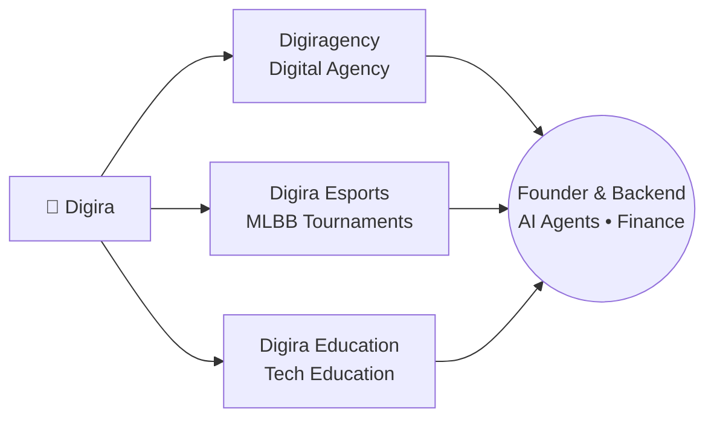

<div align="center">

<!-- Clean Header with Gradient Text -->
<h1>
  
</h1>

<h3>
  
</h3>

<p align="center">
  <a href="https://linkedin.com/in/dds3579">
    
  </a>
  <a href="https://divyadsharma.com.np">
    
  </a>
  <a href="https://github.com/dds3579">
    
  </a>
</p>


</div>

<br>

<!-- About Me Section -->
<div align="center">

## 🌟 About Me


<br><br>

**18-year-old founder from Nepal** 🇳🇵 building an entire ecosystem at the intersection of **AI, code, and community**

Currently in **Grade 12** • Running **Digira** (agency + esports + education) • President of **NSS Clubs** • Building at the edge of AI, IoT & Robotics

<br>

> *"Momentum > Perfection"* 🚀
>
> Not building a product. Building an ecosystem.

<br>

</div>

<br>

<!-- Ecosystem Map -->
<div align="center">

## 🗺️ The Digira Ecosystem



</div>

<br>

<!-- What I'm Building Section -->
<div align="center">

## 🚀 What I'm Building

</div>

<table>
<tr>
<td width="33%" valign="top">

### 🏢 Digiragency


Modern digital agency delivering:
```
→ UI/UX & Product Design
→ Web Design & Frontend Dev
→ Branding & Digital Solutions
→ AI Agents & Backend Systems
```

</td>
<td width="33%" valign="top">

### 🎮 Digira Esports


Community platform running **MLBB (Mobile Legends: Bang Bang)** tournaments across Nepal, empowering young gamers to compete and get discovered.

</td>
<td width="33%" valign="top">

### 🎓 Digira Education


The newest branch of the ecosystem — bringing practical, hands-on tech & AI education to students in Nepal.

</td>
</tr>
</table>

<br>

<!-- Roles Section -->
<div align="center">

## 🎖️ Roles & Recognition

</div>

<table>
<tr>
<td width="50%" valign="top">

**ICSC Ambassador**


Representing the **International Computer Science Competition** — [icscompetition.org](https://icscompetition.org/dsharma) — promoting competitive programming and computational thinking globally.

</td>
<td width="50%" valign="top">

**President, NSS Clubs**

Leading a 56+ member student club at National School of Sciences — organizing Tech Fest, Olympiad initiatives, and community-driven tech events.

</td>
</tr>
</table>

<br>

<!-- Skills Section -->
<div align="center">

## 💻 Tech Arsenal


</div>

<table width="100%">
<tr>
<td width="50%" align="center">

### Frontend


</td>
<td width="50%" align="center">

### Backend & Languages


</td>
</tr>
<tr>
<td width="50%" align="center">

### AI, Automation & Agents


</td>
<td width="50%" align="center">

### IoT & Robotics


</td>
</tr>
<tr>
<td colspan="2" align="center">

### Design & Tools


</td>
</tr>
</table>

<div align="center">

</div>

---

## 🎯 Current Focus

- 🏢 Scaling the **full Digira ecosystem** — agency, esports, and education, together
- 🤖 Diving into **Robotics + IoT**, layered with AI agents
- 🐍 Building backend systems and agents in **Python + FastAPI**
- ⚙️ Designing **agentic AI workflows** with n8n, LangGraph, Mastra & Ollama
- 🎨 Shipping **premium, production-ready** web experiences in Next.js
- 🤝 Leading **NSS Clubs** (56+ members) and representing **ICSC** globally

---

##  GitHub Analytics

<p align="center">
  
</p>

<p align="center">
  
</p>

<p align="center">
  
  
</p>

<p align="center">
  
</p>

---

## 🏆 Achievements & Highlights

```
🏢  Founder of Digira - a full ecosystem: agency, esports & education
🎖️  ICSC Ambassador - representing an international CS competition
👥  President of NSS Clubs - leading 56+ members
🤖  Expanding into Python, AI x IoT, and Robotics
💼  Building real-world products & ventures while in Grade 12
🌟  Momentum > Perfection advocate
```

---

## 📬 Let's Connect!

I'm always open to collaborations on products, ventures, or anything at the intersection of **AI, code, and community**.

<div align="center">

[](https://divyadsharma.com.np)
[](https://linkedin.com/in/dds3579)
[](mailto:your-email@example.com)

</div>

---

<div align="center">
  

  <br><br>

  **Thanks for visiting!** ⭐️ *Star some repositories if you find them interesting!*
</div>
