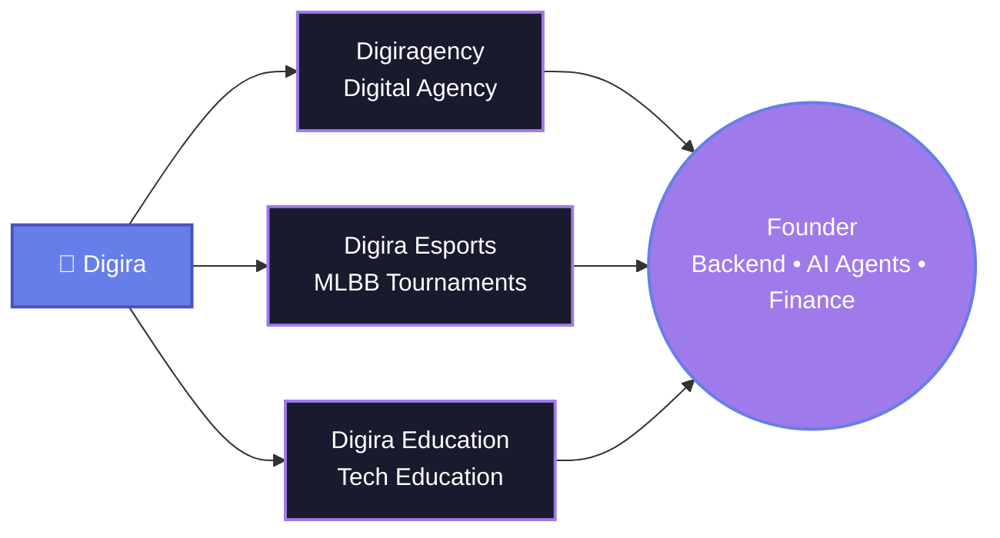

<div align="center">


<br><br>

<a href="https://linkedin.com/in/dds3579"></a>
<a href="https://divyadsharma.com.np"></a>
<a href="https://github.com/dds3579"></a>
<a href="mailto:your-email@example.com"></a>

<br><br>


<br><br>


</div>

<br>

<div align="center">

## 🌟 About Me


<br><br>

**18-year-old founder from Nepal** 🇳🇵 building at the intersection of **AI, code, and community**

Grade 12 @ National School of Sciences • Running **Digira** (agency + esports + education) • President, **NSS Clubs**

<br>

> *"Momentum > Perfection"* 🚀
> Not building a product. Building an ecosystem.

</div>

<br>


<div align="center">

## 🗺️ The Digira Ecosystem



</div>

<table>
<tr>
<td width="33%" valign="top" align="center">

### 🏢 Digiragency

Digital agency delivering UI/UX & product design, web design & frontend dev, branding, and AI agents & backend systems.

</td>
<td width="33%" valign="top" align="center">

### 🎮 Digira Esports

Community platform running **MLBB** tournaments across Nepal — empowering young gamers to compete and get discovered.

</td>
<td width="33%" valign="top" align="center">

### 🎓 Digira Education

The newest branch — bringing practical, hands-on tech & AI education to students in Nepal.

</td>
</tr>
</table>


<div align="center">

## 🎖️ Roles & Recognition

</div>

<table>
<tr>
<td width="50%" valign="top">

**🔥 ICSC Ambassador**

Representing the **International Computer Science Competition** — [icscompetition.org](https://icscompetition.org/dsharma) — promoting competitive programming and computational thinking globally.

</td>
<td width="50%" valign="top">

**👥 President, NSS Clubs**

Leading a 56+ member student club at National School of Sciences — organizing Tech Fest, Olympiad initiatives, and community-driven tech events.

</td>
</tr>
</table>


<div align="center">

## 💻 Tech Arsenal

</div>

<table width="100%">
<tr>
<td width="50%" align="center">

**Frontend**


</td>
<td width="50%" align="center">

**Backend & Languages**


</td>
</tr>
<tr>
<td width="50%" align="center">

**AI, Automation & Agents**


</td>
<td width="50%" align="center">

**IoT & Robotics**


</td>
</tr>
<tr>
<td colspan="2" align="center">

**Design & Tools**


</td>
</tr>
</table>


## 🎯 Current Focus

- 🏢 Scaling the **full Digira ecosystem** — agency, esports, and education, together
- 🤖 Diving into **Robotics + IoT**, layered with AI agents
- 🐍 Building backend systems and agents in **Python + FastAPI**
- ⚙️ Designing **agentic AI workflows** with n8n, LangGraph, Mastra & Ollama
- 🎨 Shipping **premium, production-ready** web experiences in Next.js
- 🤝 Leading **NSS Clubs** (56+ members) and representing **ICSC** globally


<div align="center">

## 🏆 Trophy Case


##  GitHub Analytics


### 🐍 Contribution Snake
*(needs one-time setup — see note below)*

<picture>
  <source media="(prefers-color-scheme: dark)" srcset="https://raw.githubusercontent.com/dds3579/dds3579/output/github-contribution-grid-snake-dark.svg">
  <source media="(prefers-color-scheme: light)" srcset="https://raw.githubusercontent.com/dds3579/dds3579/output/github-contribution-grid-snake.svg">
  
</picture>

</div>


## 🏆 Achievements & Highlights

```
🏢  Founder of Digira - a full ecosystem: agency, esports & education
🎖️  ICSC Ambassador - representing an international CS competition
👥  President of NSS Clubs - leading 56+ members
🤖  Expanding into Python, AI x IoT, and Robotics
💼  Building real-world products & ventures while in Grade 12
🌟  Momentum > Perfection advocate
```

<div align="center">

## 📬 Let's Connect!

I'm always open to collaborations on products, ventures, or anything at the intersection of **AI, code, and community**.

[](https://divyadsharma.com.np)
[](https://linkedin.com/in/dds3579)
[](mailto:your-email@example.com)

<br>


**Thanks for visiting!** ⭐️ *Star some repositories if you find them interesting!*

</div>


